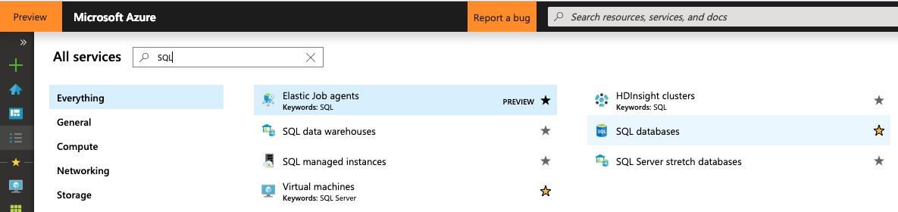
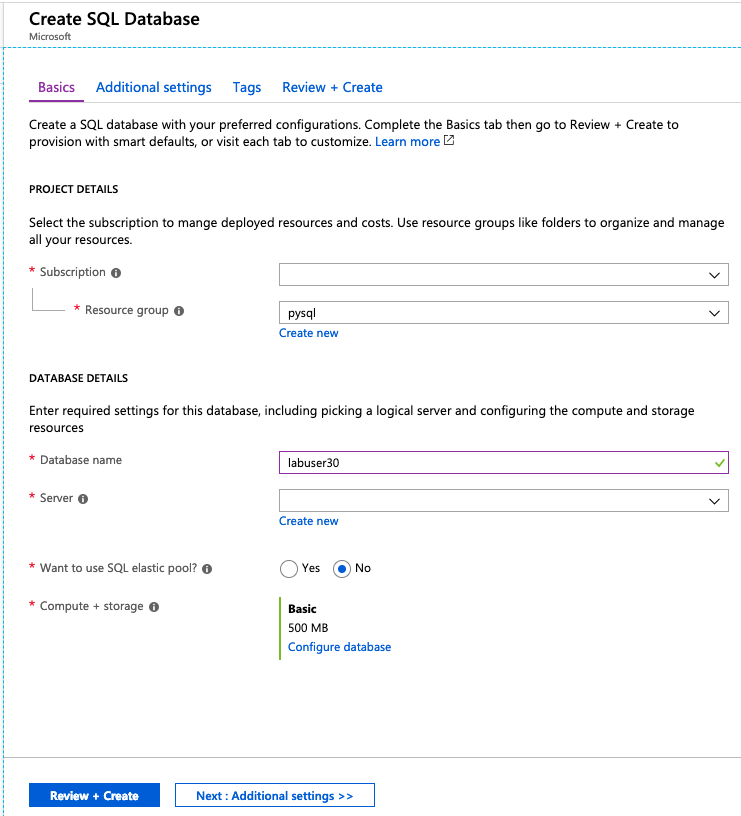
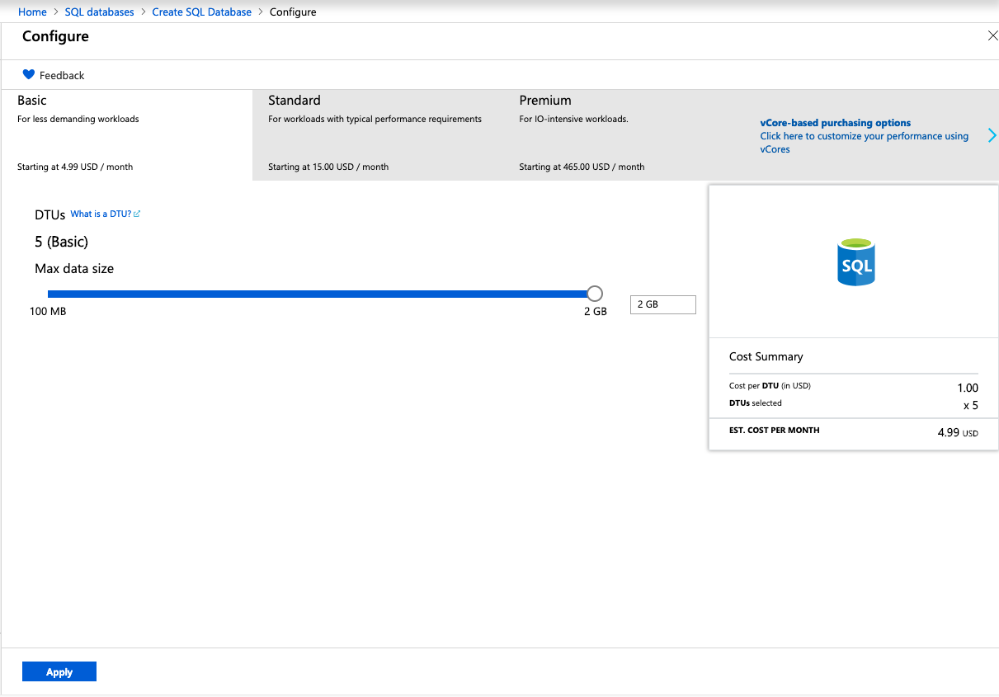
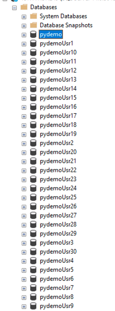
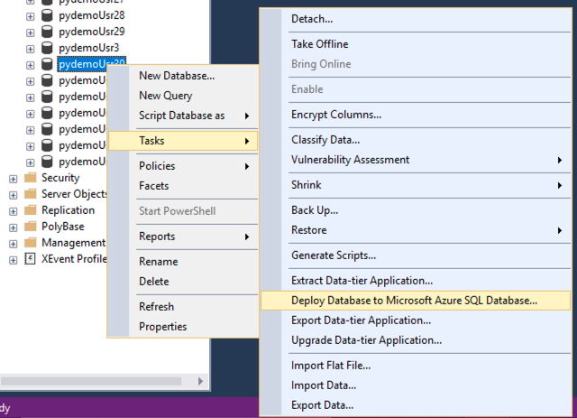
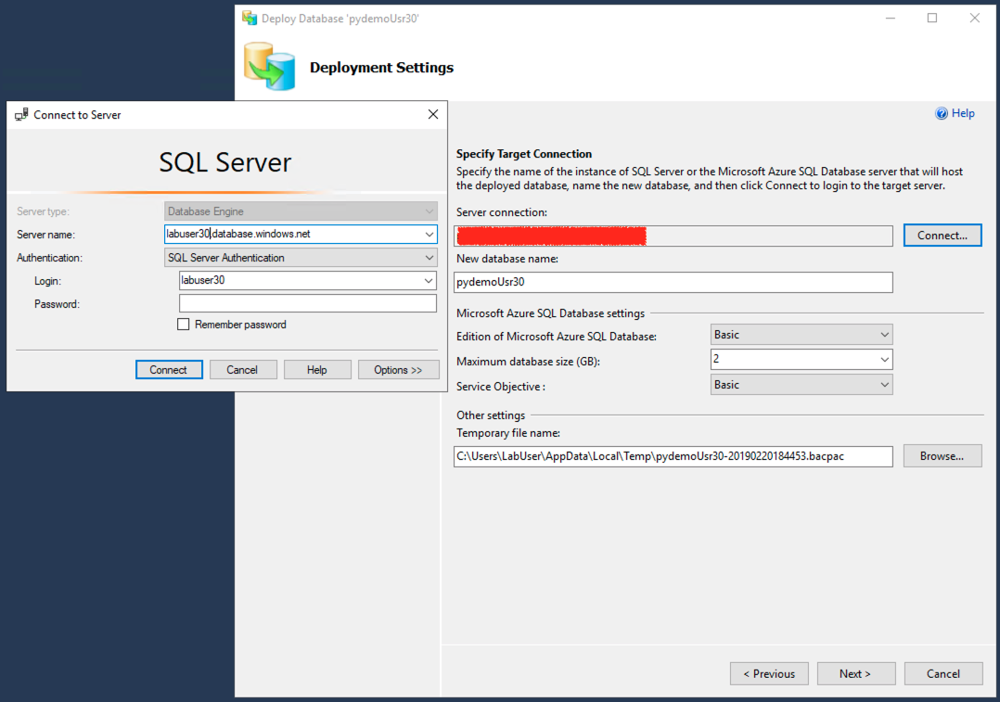
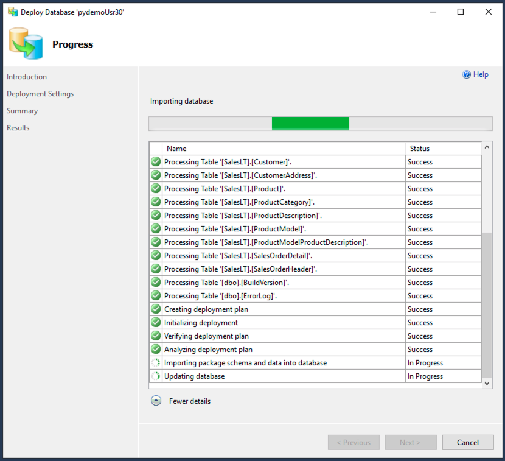
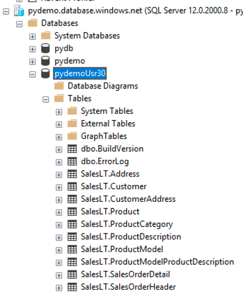

# Lab 1 - Database Migration

In this section of the lab we will migrate our Monolytic's app database into a Platform as a Service (PaaS) model. We will be using the Deploy to Azure method from MS SQL Server Management Studio.

## Tools used in this lab

  - [Microsoft Azure SQL](https://docs.microsoft.com/en-us/azure/sql-database/sql-database-technical-overview)
  - [Microsoft SQL Server Management Studio](https://docs.microsoft.com/en-us/sql/ssms/sql-server-management-studio-ssms?view=sql-server-2017)
  

## Creating a Hosting Azure SQL Database

In this set of steps you are tasked to migrate an existing database running on a Linux Physical Server. You are given all the necessary credentials and the name of the database in order to perform this task.

Perform this steps in either your **own** Workstation or on the **Lab** Workstation:

  1. Login to your Azure Portal.
  2. In the Azure Portal click on the **All services** option and look for SQL, select **SQL databases**.
   

  3. Click on  to  create a new SQL Server.
  4. Under **Project Details** select your subscription and create a new resource group named: *"pysql"*.
  5. Under **Database Details** name the database: *"pydb"*. 
  6. On **Server** select **Create new**, a new pane will be open, fill it out with the following information:
   * **Server Name**: "labuser#"
   * **Server admin login**: "labuser#"
   * **Password**: **Provided by instructor*
   * **Location**: East US
  
  7. Click on **Select**.
  8. On **Want to use SQL elastic  pool?** select **no**.
  9. On **Compute + storage** click on **Configure database**.
  10. On the top left click on **Looking for basic, standard...**.
  11. Select the following configuration:
  12. Click on **Apply**.
  13. Click **Review + Create**.

## Migrating the Database

Perfom this steps on the **Lab Workstation**:

  1. Open Microsoft SQL Server Management Studio 17 from the icon in your desktop:
   

2. Login with the credentials and the IP provided by the instructor. **Use SQL Authentication**
3. You should be able to see a list of databases ready for migration:  
  
4. Select the database corresponding to the **user number** assigned to you and right click on it.
5. Select **Tasks > Deploy Database to Microsoft Azure SQL Database..**: 
6. You will be prompted with the **Introduction**, click **Next**.
7. Under **Deployment Settings**, click on **Connect** and enter the credentials of your recently created **Azure SQL Server**, leave the new Database name the same. 
8. Click on **Next**, review the summary and click **Finish**.
9. Wait for all tasks to finish:
10. Once it finished, in your SQL Management studio click on **Connect**   and enter your Azure SQL credentials. You should be able to see the migrated database now:
    
  

  Now lets continue to our next Lab.

  [Next >](lab_2.md)