# Lab 2 - Application Migration

In this lab we will be migrating a monolythic application to a Platform as a Service Environment hosted in Azure App Service.

## Tools used in this lab

  - [Visual Studio Code](https://code.visualstudio.com/)
  - [Windows Subsystem For Linux](https://docs.microsoft.com/en-us/windows/wsl/enterprise)
  - [Microsoft Azure App Service](https://azure.microsoft.com/en-us/services/app-service/?v=18.51)

## Migrating the application

In this step of the workshop, you will have to collect all the application files and migrate them to an Azure App Service. All you know is that the application lives in */usr/local/flask*, in the same server as the database.

All the steps in this lab are performed in the Azure Lab Service workstation.

1. On Azure Lab Service Workstation, open the Ubuntu Windows Subsystem for Linux app in your taskbar:
   
    
2. Once open type the following command to connect to the application server: 
  ```bash
  ssh <UserAssigned>@<IP>
  ```

3. Check the application files under the indicated directory by running:

  ```bash
  ls -lath /usr/local/flask/
  ```
 
4. Check if the following files are present:
   * static
   * templates
   * estusflask.py
  
5. Log out from the server by running: 
   ```bash
   exit
   ```
6. Once you  are back on the WSL prompt, extract the files from the application server by running the following commands: 
   ```bash
   cd /mnt/c/Users/LabUser/Documents
   mkdirk app
   cd app
   scp -r <user>@<ip>:/usr/local/flask/*  .
   ```
7. Now with the files on your local machine, open Visual Studio Code to begin with the migration process:
   
   ```bash
   code .
   ```

8. We now need to download the appropiate extensions in order to be able to publish our application to azure. Click on the extensions option in VS Code:   
9. In the Extensions Marketplace look for the Azure Account Extension and click on **Install**: 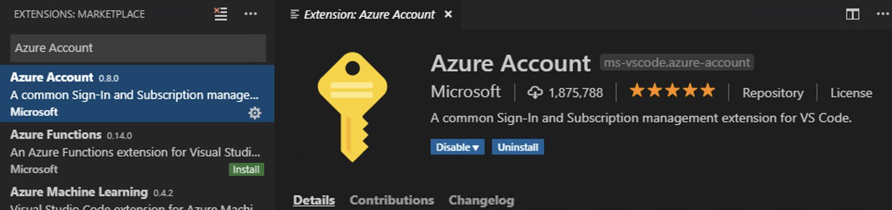
10. Do the same as in the previous step but for the Azure App Service Extension: 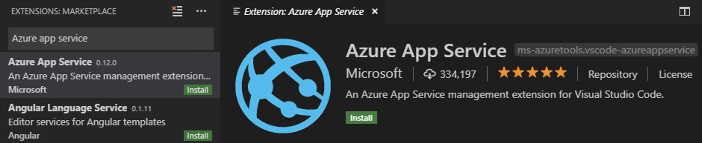
    
11. Once both extensions have been installed, an Azure icon will appear on the left: . Click on it and login to your subscription:
   
    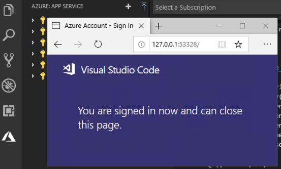

12. Before migrating our application we need to do some modifications, create a requirements.txt file with the following content:
       ```
        Flask>=1.0.2
        pyodbc==4.0.24
      ```
13. Delete the *envs* file.
14. Rename *estusflask.py* to *application.py*
15. Modify the file *templates >  index.html* to reflect the following:
    
    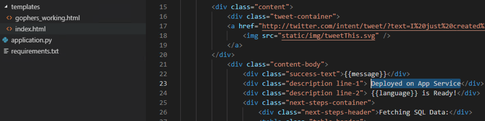

16. Save the changes on all files modified so far:
    * requirements.txt
    * index.html

17. To deploy the application click back on the Azure Icon: 
18. Click on the **+** sign next to **Azure: App Service** and follow the prompts: 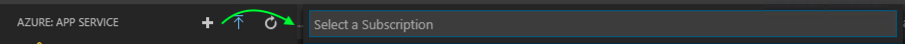
19. Wait for the **Creating Web App** message to finish and click on **Yes** once the **Deploy to web app?** appears: 
    
    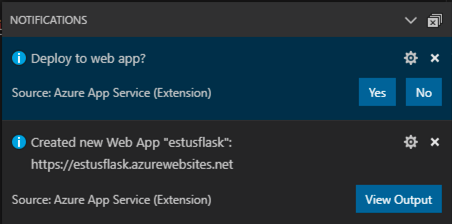

20. Click on the app folder to deploy: 
 
    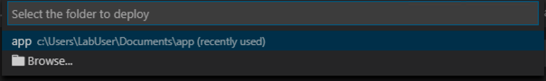

22. Browse to your application.

21. Inform your instructor that you have reached this step.

22. Comment the following lines on *application.py* and remove the data=data entry on the first **return**, finally save the file:

    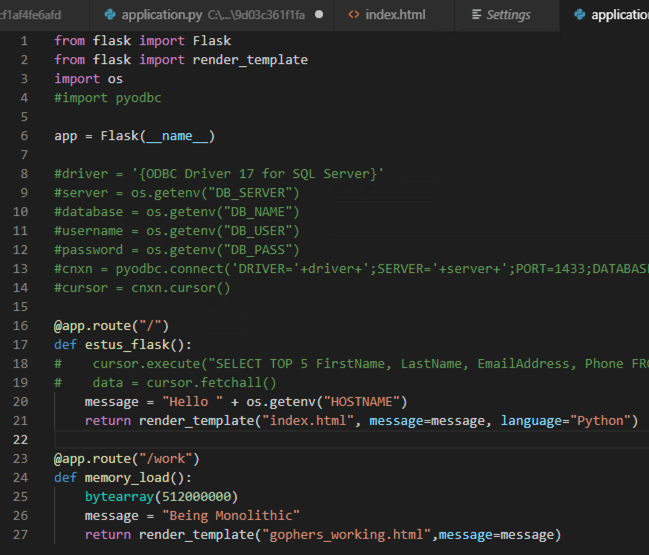

23. Open the **Azure Portal** and under all services look for **App Service** and select your **Web App**.

24. Under **Settings** click on **Application Setttings** and scroll down to **App Settings Name** add the key *HOSTNAME* with the value of your name: 
    
    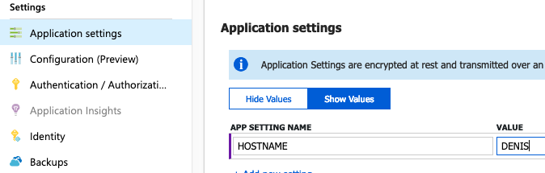

25. Back in **Visual Studio Code** click on deploy to web app and follow the prompts selecting your web app: 

    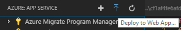

26. Browse to your application. 
    
    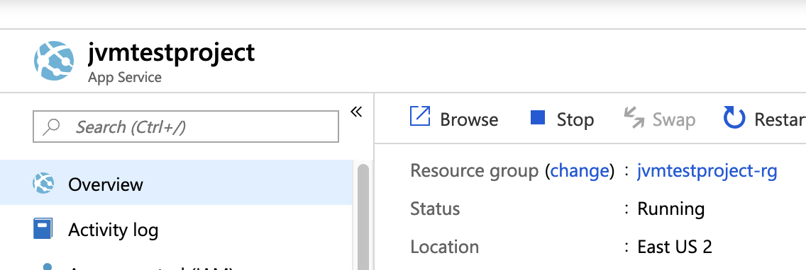
    [Next >](lab_3.md)