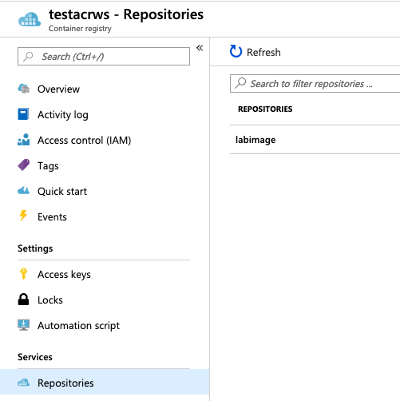

# Lab 3 - Part 1 - Containerizing the application


## Tools used in this lab

- [Visual Studio Code](https://code.visualstudio.com/)
- [Windows Subsystem For Linux](https://docs.microsoft.com/en-us/windows/wsl/enterprise)
- [Docker For Windows](https://docs.docker.com/docker-for-windows/)
- [Azure Kubernetes Services](https://docs.microsoft.com/en-us/azure/aks/)
- [Azure CLI](https://docs.microsoft.com/en-us/cli/azure/?view=azure-cli-latest)
- [Azure Container Registry](https://azure.microsoft.com/en-us/services/container-registry/)

## Modernizing with Containers

### Part 1

1. Back in **Visual Studio Code** create a new file called **Dockerfile** and copy the following into the file(Remember to save the file):
   
   ```Docker
   FROM ubuntu:latest

   COPY . /

   RUN apt-get update && \
       apt-get install -y curl \
       python3 \
       python3-pip \
       unixodbc-dev && \
       curl https://packages.microsoft.com/keys/microsoft.asc | apt-key add - && \
       curl https://packages.microsoft.com/config/ubuntu/16.04/prod.list > /etc/apt/sources.list.d/mssql-release.list && \
       apt-get update && \
       apt-get install -y libssl-dev \
       libssl1.0.0 && \
       ACCEPT_EULA=Y apt-get install -y msodbcsql17 && \
       pip3 install -r requirements.txt

   ENV FLASK_APP=application.py
   ENV LC_ALL=C.UTF-8
   ENV LANG=C.UTF-8

   EXPOSE 8080

   ENTRYPOINT python3 -m flask run --host=0.0.0.0 --port=8080
   ```

2. Select the **application.py** file, and uncomment the previously commented sections and add back the *data* variable (Remember to save the file):
   
    ```Python
    from flask import Flask
    from flask import render_template
    import os
    import pyodbc

    app = Flask(__name__)

    driver = '{ODBC Driver 17 for SQL Server}'
    server = os.getenv("DB_SERVER")
    database = os.getenv("DB_NAME")
    username = os.getenv("DB_USER")
    password = os.getenv("DB_PASS")
    cnxn = pyodbc.connect('DRIVER='+driver+';SERVER='+server+';PORT=1433;DATABASE='+database+';UID='+username+';PWD='+ password)
    cursor = cnxn.cursor()

    @app.route("/")
    def estus_flask():
        cursor.execute("SELECT TOP 5 FirstName, LastName, EmailAddress, Phone FROM SalesLT.Customer")
        data = cursor.fetchall()
        message = "Hello " + os.getenv("HOSTNAME")
        return render_template("index.html", message=message, language="Python",data=data)

    @app.route("/work")
    def memory_load():
        bytearray(512000000)
        message = "Being Monolithic"
        return render_template("gophers_working.html",message=message)
    ```

3. Go back to your Windows Subsystem for Linux Prompt and type the following command:
   
   ```Docker
    docker image build -t application:local .
   ```

4. Wait for the build to finish and once finished type the following command to run the container, the fields after -e you can get them from your **Azure SQL Database** :

    ```Docker
    docker container run -d -p 80:8080 -e DB_NAME=<dbname> \
        -e DB_SERVER=<dbserver> \
        -e DB_USER=<dbuser> \
        -e DB_PASS=<password> \
        application:local
    ```


5. You can run the following command to check if the container is running:

    ```Docker
    docker container ps
    ```
  
6. Open a web browser and go to http://localhost you should be  able to see the application running and connecting to the database.

7. Now that we have our image created. Lets uploaded to an **Azure Container Registry**. In the Linux terminal, run:
   
   ```Bash
    az login

    az group create -l eastus -n ACR

    az acr create -n <MyRegistry> -g ACR --sku Basic

    az acr login -n <MyRegistry>

    docker image tag application:local \
        <MyRegistry>.azurecr.io/application:mono

    docker image push <MyRegistry>.azurecr.io/application:mono
    ```

8. Now that you have pushed the image, check the **Azure Container Registry** in the **Azure Portal** and see if the image is  listed under **Repositories**:
   
   

9. With our image in **Azure Container Registry** we are ready to create our Kubernetes Cluster:
    
    ```Bash
    az group create -l eastus -n AKS

    az aks create \
      --resource-group AKS \
      --name LabAKS \
      --node-count 2 \
      --enable-addons monitoring \
      --generate-ssh-keys
    ```

10. With the cluster deployed, proceed to install the Kubernetes CLI tool:
    
    ```Bash
    az aks install-cli

    az aks get-credentials -g AKS --name LabAKS

    kubectl get nodes
    ```

[Next >](lab_3_1.md)