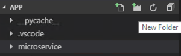

# Lab 3 - Part 2 - Microservicing and Orchestration

## Tools used in this lab

- [Visual Studio Code](https://code.visualstudio.com/)
- [Windows Subsystem For Linux](https://docs.microsoft.com/en-us/windows/wsl/enterprise)
- [Docker For Windows](https://docs.docker.com/docker-for-windows/)
- [Azure Kubernetes Services](https://docs.microsoft.com/en-us/azure/aks/)
- [Azure CLI](https://docs.microsoft.com/en-us/cli/azure/?view=azure-cli-latest)
- [Azure Container Registry](https://azure.microsoft.com/en-us/services/container-registry/)

## Microservicing our application

1. Modify **application.py** in the following way (save the file):

    ```Python
    from flask import Flask
    from flask import render_template
    import os
    import pyodbc
    import urllib.request
    import html

    app = Flask(__name__)

    driver = '{ODBC Driver 17 for SQL Server}'
    server = os.getenv("DB_SERVER")
    database = os.getenv("DB_NAME")
    username = os.getenv("DB_USER")
    password = os.getenv("DB_PASS")
    cnxn = pyodbc.connect('DRIVER='+driver+';SERVER='+server+';PORT=1433;DATABASE='+database+';UID='+username+';PWD='+ password)
    cursor = cnxn.cursor()

    @app.route("/")
    def estus_flask():
        cursor.execute("SELECT TOP 5 FirstName, LastName, EmailAddress, Phone FROM SalesLT.Customer")
        data = cursor.fetchall()
        message = "Hello " + os.getenv("HOSTNAME")
        return render_template("index.html", message=message, language="Python",data=data)

    @app.route("/work")
    def memory_load():
        message= str(urllib.request.urlopen("http://memload:8080").read())
        message = message.replace("b","")
        message = message.replace("'","")
        return render_template("gophers_working.html",message=message)
    ```

2. Create a new folder in **Visual Studio Code** and name it *microservice*:
   
   
   
3. Create a new file called **microload.py** under the new folder(save the file):
   
   ```Python
    from flask import Flask

    app = Flask(__name__)

    @app.route("/")
    def microservice():
        bytearray(512000000)
        message = "Microserviced!!"
        return message
   ```

4. Create a new Dockerfile under the *microservice* folder:
   
   ```Docker
    FROM ubuntu:latest

    COPY microload.py /

    RUN apt-get update && \
          apt-get install -y \
          python3 \
          python3-pip && \
          pip3 install flask

    ENV FLASK_APP=microload.py
    ENV LC_ALL=C.UTF-8
    ENV LANG=C.UTF-8

    EXPOSE 8080

    ENTRYPOINT python3 -m flask run --host=0.0.0.0 --port=8080
   ```

5. Proceed to build and push the container:

    ```Docker
    docker image build -t <MyRegistry>.azurecr.io/microload:micro ./microservice/
    
    docker image push <MyRegistry>.azurecr.io/microload:micro
    ```

6. Create a docker build of the new **application.py** now that its microserviced:

  ```Docker

  docker image build -t <MyRegistry>.azurecr.io/application:micro

  docker image push <MyRegistry>.azurecr.io/application:micro

  ```

7. Now both images are in our private registry, in **Visual Studio Code** create a folder called *kubernetes*.

8. To be able to pull images out of our private registry we need to create credenitals:

  ```bash
    az acr update -n <MyRegistry> --admin-enabled true
    
    az acr credential show -n <MyRegistry> -o table
    ```
9. Save any of the passwords shown in the output of the last command.
10. Run the following command for kubernetes to be able to pull images:

  ```bash
  kubectl create secret docker-registry acrcred \ 
    --docker-server=https://myregistry.azurecr.io \
    --docker-username=<MyRegistry> \
    --docker-password=<ACR PASSWORD> \
    --docker-email=ANY_EMAIL_ADDRESS
  ```

