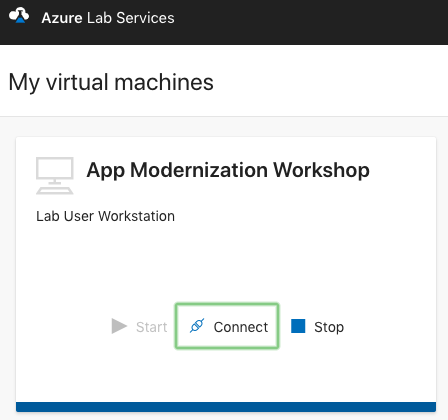

# Accesing the lab

For this lab we will be using [Azure Lab Services](https://azure.microsoft.com/en-us/services/lab-services/). Azure Lab Services lets you create managed labs, such as classroom labs. The service itself handles all the infrastructure management for a managed lab, from spinning up VMs to handling errors, and scaling the infrastructure. The managed labs are currently in preview. Once the preview ends, the new lab types and existing DevTest Labs come under the new common umbrella name of Azure Lab Services where all lab types continue to evolve.

## Instructions

To access the lab, follow the next instructions:

  1. A link to a spreadsheet will be provided in order for the instructor to give you access.
  2. Once you have provided your email address, proceed to the registration [link](https://labs.azure.com/register/twicikme).
  3. Log in or create a Microsoft account using the email provided to the instructor.
  4. Start the VM.
  5. Wait for the VM to start and click on *"Connect"* to download the RDP file:
  
  
  6. Password will be provided by the instructor.
  7. Activate your Azure Pass following the [HowTo Guide](https://www.microsoftazurepass.com/Home/HowTo)

## Next Steps

Our next steps will consist of starting our journey to the cloud.

[Next >](lab_1.md)
