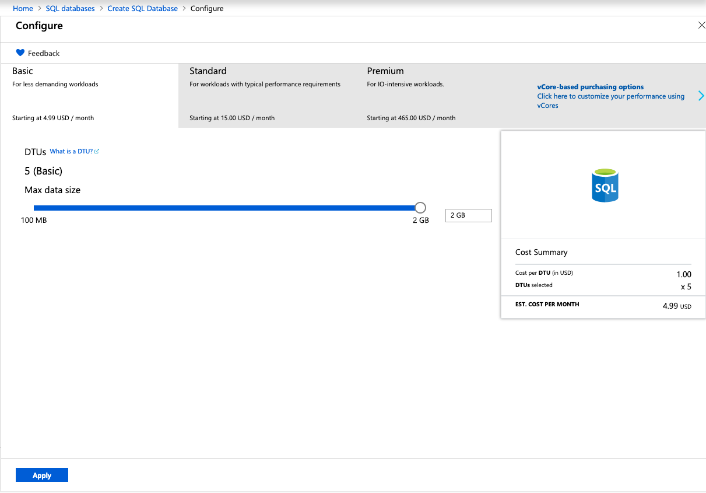

# Part 1 - Platform as a Service

In this section of the lab we will migrate our application into a Platform as a Service (PaaS) model. We will be using the Deploy to Azure  method from MS SQL Server Management Studio.

## Tools used in this section

  - [Visual Studio Code](https://code.visualstudio.com/)
  - [Windows Subsystem For Linux](https://docs.microsoft.com/en-us/windows/wsl/enterprise)
  - [Microsoft Azure App Service](https://azure.microsoft.com/en-us/services/app-service/?v=18.51)
  - [Microsoft Azure SQL](https://docs.microsoft.com/en-us/azure/sql-database/sql-database-technical-overview)
  - [Microsoft SQL Server Management Studio](https://docs.microsoft.com/en-us/sql/ssms/sql-server-management-studio-ssms?view=sql-server-2017)
  

## Database Migration

Once you RDP back to the workstation follow the next instructions to migrate the SQL database to the managed Azure SQL service:

  1. Login to your Azure Portal.
  2. In the Azure Portal click on the *"All services"* option and look for SQL, select *"SQL databases"*.
   

  3. Click on  to  create a new SQL Server.
  4. Under **Project Details** select your subscription and create a new resource group named: *"pysql"*.
  5. Under **Database Details** name the database: *"pydb"*.
  6. On **Server** select **Create new**, a new pane will be open, fill it out with the following information:
   * **Server Name**: "labuser#"
   * **Server admin login**: "labuser#"
   * **Password**: **Provided by instructor*
   * Location: East US
  
  7. Click on **Select**.
  8. On **Want to use SQL elastic  pool?** select **no**.
  9. On **Compute + storage** click on **Configure database**.
  10. On the top left click on **Looking for basic, standard...**.
  11. Select the following configuration:
  12. Click on **Apply**.
  13. Click **Review + Create**.

  14. Open Microsoft SQL Server Management Studio 17 from the icon in your desktop:
   

1. Login with the credentials and the IP provided by the instructor.
2. b.